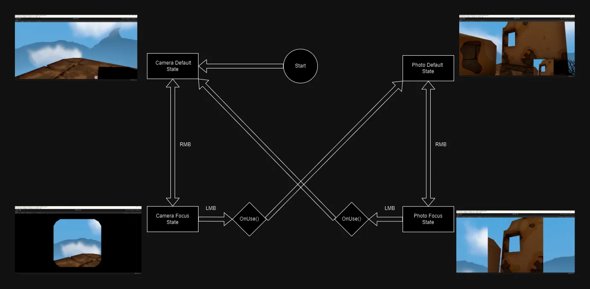

# Viewfinder Copy

An exercise in Unity with the goal of recreating a mechanic from a game called 'Viewfinder'. This mechanic revolves around copying objects based on the camera's perspective and then placing them back into the world.

*Version: Unity 2021.3.15f1*

 

## Trailer:

## My Video about this:

## Important
- If the mesh is not planar, then it must be convex.
- Add the class "Slicerable" to the objects that can be copiable.
- This code just support objects with 1 material (To be fixed).
- This code runs at the main thread (to be fixed, using MeshData+Job).
- There are a default material to the new faces, that can be changed.
- The new vertices has same UV cordinates (default, same as Vector.Zero).
- The triangulation method is Fan Triangulation (to be changed).

## Relevant Scripts

### ItemController, PlayerItemsManager, etc
These scripts regulate the change of items. The `Photo` and `CameraScript` are the unique Items in this project. Adapted from the scripts in the FPS Microgame from Unity (templete I used).

RMB will toggle between default state and focus state. When in focus, LMB will execute the `OnUse()` and select the other Item.

### CameraScript -> ItemController
This script tells `_Photo` to take a capture using `SayCheese()` when `OnUse()`.

### Photo -> ItemController
`SayCheese()` gets the frustum with the `Slicerable` objects that are inside it, the background image of photo and the `Photo` object.

`CopyObjects()` copies the objects (`lightmapIndex` and `lightmapScaleOffset` are not serialized, so they cannot be copied in the standard way),
cuts the meshes and places the PhotoOutput as its parent (PhotoOutput an object created with the same orientation as the camera). Then it sets the PhotoOutput to inactive. This method will perhaps be using Jobs in the future.

`OnUse()` sets the PhotoOutput to active again and sets its orientation to the same as the camera.

### Slicerable
A script to determine if an object can be copied and cut. It also contains additional data like the material of the new faces.

### MeshUtils
A static class that has some methods for mesh manipulation.
`MeshCut()` is the meshes that really cut the meshes. The steps of this method are showed in the video.

A static class that has some methods for mesh manipulation. Meshes are only cut in MeshCut(). The steps of this code are shown in my video.

<<<<<<< HEAD
The code is a little bit obscure and incomplete. I'm still looking for a balance between performance and readability, so this will probably be rewritten someday with `MeshData`.
=======
The code is a little bit obscure and incomplete. I'm still looking for a balance between performance and readability, so this will probably be rewritten someday with `MeshData`.
>>>>>>> 2447bc270d4931fc51d76d0d95e79f77c935282a
